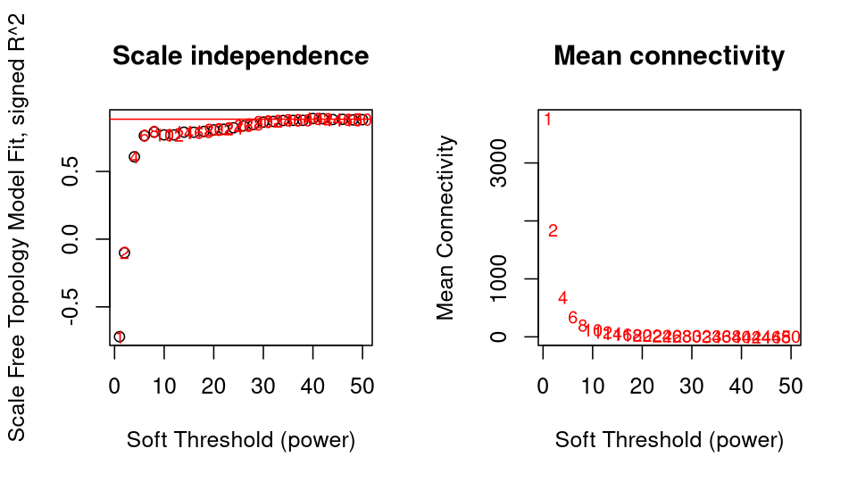
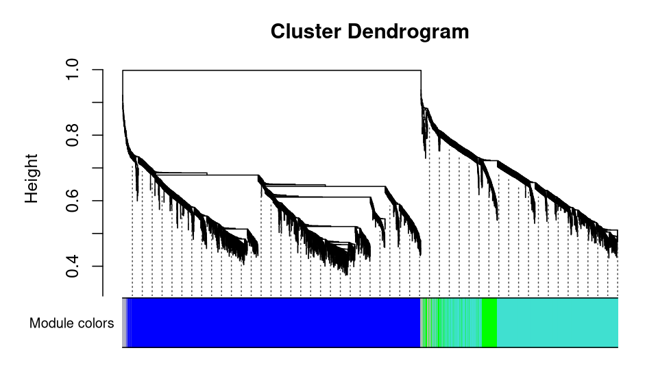
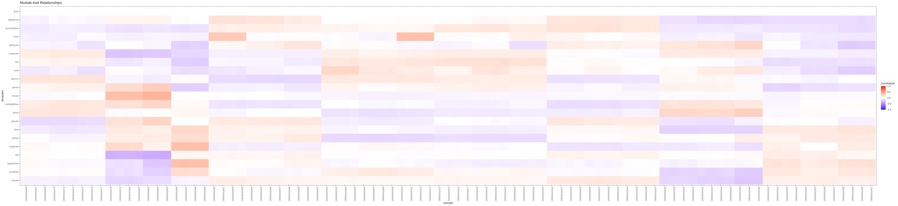
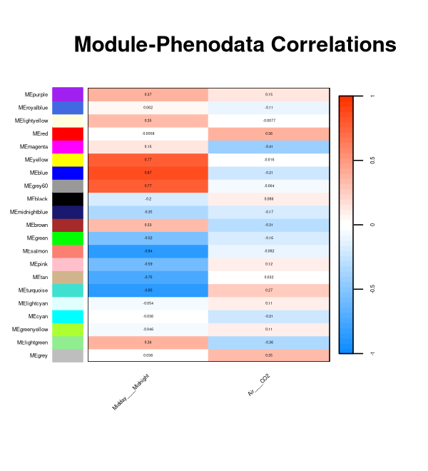

# Auto_WGCNA

Auto_WGCNA is an R script designed to automatically perform the entire workflow pipeline with WGCNA.
This script was designed to automate the process of identifying gene expression patterns and generating metrics and graphs useful for subsequent analysis.


## Index

- [Description](#Description)
- [Installation](#Installation)
- [Startup](#Startup)
- [Usage](#Usage)
- [Contacts](#Contacts)
- [Credits](#Credits)


## Description

Auto_WGCNA is an R script designed to automatically perform the entire workflow pipeline with WGCNA.

First, auto_WGCNA takes the count matrix and, if necessary, a phenotype matrix as input, performs pre-processing, and passes it to DESeq2 for count normalization.

After this phase, the topological network analysis function is performed on several predefined powers, and a high-resolution graph is generated for evaluation by the user.

Auto_WGCNA allows the user to choose the power value they consider most valid, or to let auto_WGCNA decide this power value.

Thanks to this power value, the TOM network is constructed and the gene expression modules for the input data are identified.

Subsequently, for each gene module, the modules' eigengenes are identified, the module-phenotype correlations are calculated, gene expression graphs are generated for each module, and, in the final phase, the hub genes of each gene module are estimated.

For all these steps, auto_WGCNA produces graphs in TIFF (high resolution) and PNG formats for accurate consultation and representation of the values produced during the analysis.

auto_WGCNA has a `main()` function that is executed first and manages the entire execution flow of the script, calling all the other functions needed to perform the various modules of the entire process.

Below are all the functions in the script along with their purpose:

- `parse_arguments()`: function that allows you to parse the arguments passed by the user to the script.
  
- `count_normalization()`: function that takes the table produced by prepDe.py as input, processes it, and builds/saves the input for WGCNA (using DESeq2).
  
- `threshold_calculation_manual()`: function that calculates possible soft thresholds and asks the user to enter a soft threshold value to be used for the next steps.
  
- `threshold_calculation_automatic()`: ffunction that calculates possible soft thresholds and identifies plateaus. It selects the longest plateau and automatically chooses the average power of the longest plateau. If it does not find any plateaus, it returns the highest power.
    
- `plot_threshold_charts()`: function that prints the following two graphs:
    - Scale Indipendence: chart showing how closely the constructed network (for each power value) follows a scale-free topology
    - Mean Connectivity: chart showing the average number of connections for each node, as a function of power value.
      
- `network_build()`: This function uses WGCNA to construct the gene co-expression network and identifies modules of related genes.
  
- `plot_dendogram()`: function that prints the chart (dendrogram) highlighting the correlations between genes performed by the `network_build()` function.

- `save_colors_list()`: function that saves a table in which each row contains the name of a gene and the corresponding module to which it belongs.

- `identify_eigengenes()`: function that identifies and saves all eigengenes for each individual module.

- `calculate_modpheno_correlation()`: function that calculates the correlation between phenotypic traits and various gene modules.

- `plot_modpheno_heatmap()`: function that prints the chart of the correlation between phenotypic traits and various gene modules.

- `plot_heatmap()`: function that prints the chart (heatmap).

- `plot_expression_profiles()`: function that produces a chart with expression profiles for each gene module.

- `identify_hub_genes()`: function that calculates the hub genes of each individual module.

- `writeExecTime()`: function that calculates execution time of the script and submodules and prints them to a text file.


## Installation

auto_WGCNA depends on the following R libraries:

- WGCNA
- tidyverse 
- DESeq2
- optparse  
- igraph

which can be installed using the following command (in the R shell):

```{R}
install.packages("BiocManager")
BiocManager::install("DESeq2")
BiocManager::install("WGCNA")
install.packages("optparse")
install.packages("tidyverse")
install.packages("igraph")
```


## Startup

The auto_WGCNA script is executed by running the Rscript command. 
Two operating modes are provided:

### 2-step method (manual):

1. Execute the following command
```{bash}
Rscript path/to/source_code/auto_WGCNA.R \
    -d path/to/working_directory \
    -c path/to/gene_count_matrix \
    -m manual \
    [-p absolute/path/to/phenodata_matrix] \
    [-t nthreads] 
```

2. Once the command has been executed, the graph containing the data calculated by the `pickSoftThreshold` function will be available in the ‘charts’ folder (inside the working directory), under the name threshold.tiff/threshold.png.

3. Once you have decided on the threshold value to use, run the following command:
```{bash}
Rscript path/to/source_code/auto_WGCNA.R \
    -d abdolute/path/to/working_directory \
    -c absolute/path/to/gene_count_matrix \
    -m manual \
    -y threshold \
    [-p absolute/path/to/phenodata_matrix] \
    [-t nthreads]
```


### 1-step method (automatic):

Execute the following command:

```{bash}
Rscript path/to/source_code/WGCNA_script.R \
    -d absolute/path/to/working_directory \
    -c absolute/path/to/gene_count_matrix \
    [-p absolute/path/to/phenodata_matrix] \
    [-t nthreads]
```

or

```{bash}
Rscript path/to/source_code/WGCNA_script.R \
    -d absolute/path/to/working_directory \
    -c absolute/path/to/gene_count_matrix \
    -m automatic
    [-p absolute/path/to/phenodata_matrix] \
    [-t nthreads]
```


> [!TIP] 
> The options indicated in square brackets are optional.


## Usage

This section provides two examples of execution (one for each execution mode).

> [!NOTE] 
> All files generated by running auto_WGCNA are already present in the `output` folder. 
> We recommend reviewing them before continuing with the tutorial. Once you are ready, delete all the content inside the `output` folder and follow the tutorial.


### 2-step method (manual)

Go to the folder where auto_WGCNA is located and run the following command:

```{bash}
Rscript auto_WGCNA.R \
    -d absolute/path/to/auto_WGCNA/output \
    -c absolute/path/to/auto_WGCNA/input/... \
    -p absolute/path/to/auto_WGCNA/input/... \
    -m manual
```

auto_WGCNA will execute the first part of the script and produce, among others, the following chart:



Once you have examined the graph and chosen a suitable value for the soft threshold, run the following command, entering this value as the `-y` argument (in this case, `0.8` was chosen):

```{bash}
Rscript auto_WGCNA.R \
    -d absolute/path/to/auto_WGCNA/output \
    -c absolute/path/to/auto_WGCNA/input/... \
    -p absolute/path/to/auto_WGCNA/input/... \
    -m manual \
    -y 0.8
```

and the script will be executed until the end.


### 1-step method (automatic)

Go to the folder where auto_WGCNA is located and run the following command:

```{bash}
Rscript auto_WGCNA.R \
    -d absolute/path/to/auto_WGCNA/output \
    -c absolute/path/to/auto_WGCNA/input/... \
    -p absolute/path/to/auto_WGCNA/input/... \
    -m automatic
```

(in the case of automatic execution, the `-m` argument can be omitted)

Once auto_WGCNA has finished running, the following charts are produced:

Soft threshold chart:


Dendogram chart:



Heatmap chart:



Module-Phenodata chart:



Module expression profiles charts:


It is possible to find one of these for each module in the folder `module_profiles`

Top gene network chart:


Along with saving tables and files useful for in-depth analysis.
For more details on auto_WGCNA, please refer to this paper.


## Contacts

Prof. Tiziana Castrignanò, tiziana.castrignano@unitus.it
